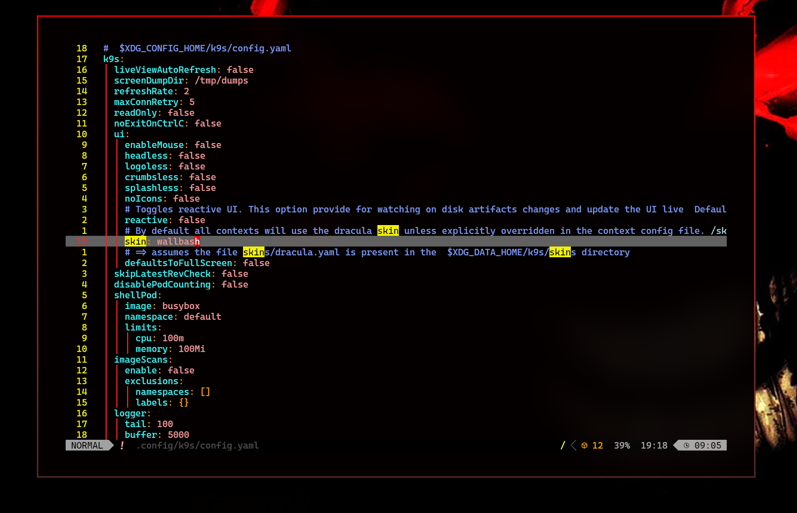

# K9s skin for Wallbash

This is wallbash skin for [k9s](https://github.com/derailed/k9s)

## Installation

1. Copy `k9s.dcol` to `~/.config/hyde/wallbash/always/k9s.dcol`

```
cp k9s.dcol ~/.config/hyde/wallbash/always/k9s.dcol
```

2. Run `hydectl reload` to reload wallbash configuration

```
hydectl reload
```

3. Be sure to restart your `k9s` client

## Configuration

Be sure to set the skin `~/.config/k9s/config.yaml` to `wallbash`



## Thanks to

- [k9s](https://github.com/derailed/k9s)
